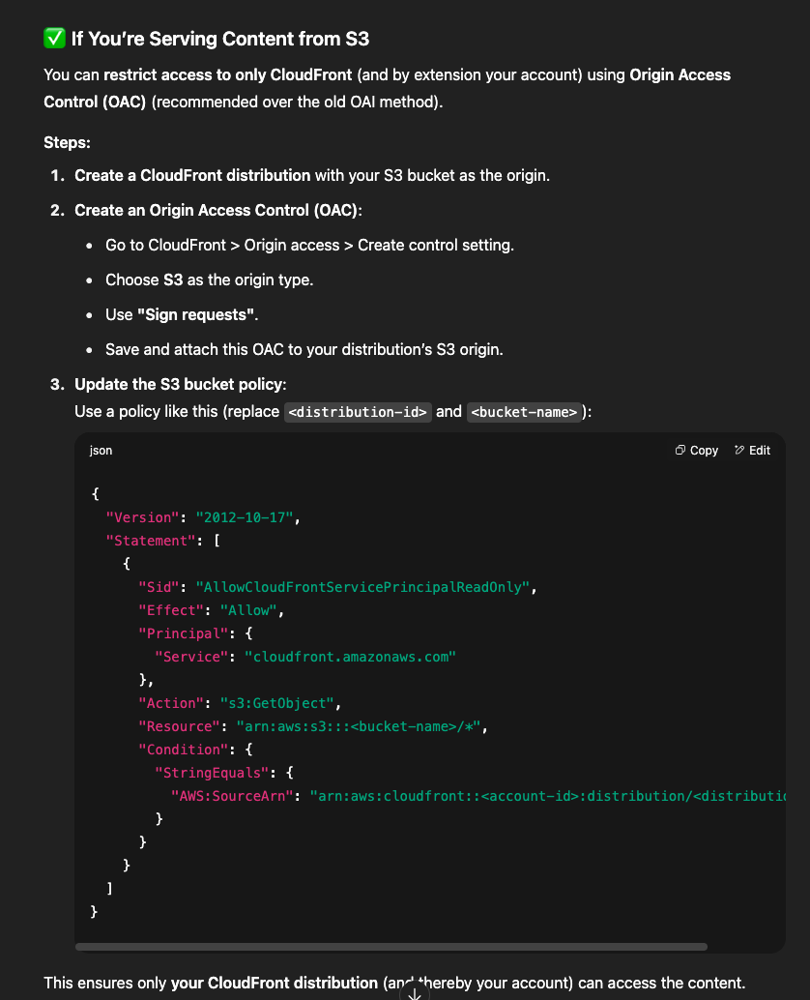
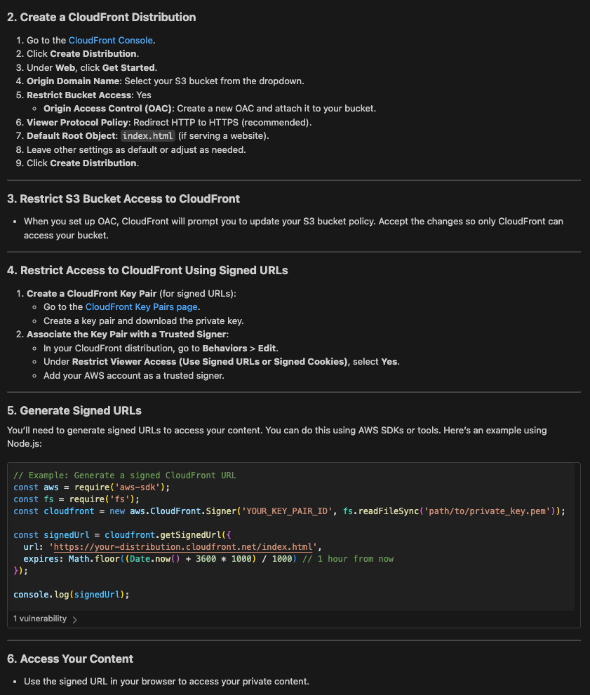
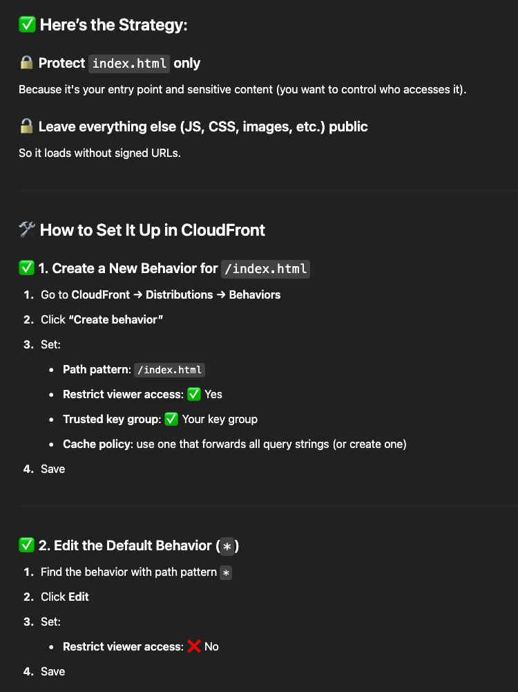

To run:

- npm run build
- upload dist to AWS S3 bucket
- enable static website hosting in S3
- set up cloudfront





S3 Policy: 
```json
{
    "Version": "2012-10-17",
    "Statement": [
        {
            "Sid": "AllowCloudFrontOACAccess",
            "Effect": "Allow",
            "Principal": {
                "Service": "cloudfront.amazonaws.com"
            },
            "Action": "s3:GetObject",
            "Resource": "arn:aws:s3:::lordfundarbyrd-testapp/*",
            "Condition": {
                "StringEquals": {
                    "AWS:SourceArn": "arn:aws:cloudfront::119725036977:distribution/E3CI0PSH1WP14W"
                }
            }
        },
        {
            "Sid": "AWSLogDeliveryWrite1",
            "Effect": "Allow",
            "Principal": {
                "Service": "delivery.logs.amazonaws.com"
            },
            "Action": "s3:PutObject",
            "Resource": "arn:aws:s3:::lordfundarbyrd-testapp/AWSLogs/119725036977/CloudFront/*",
            "Condition": {
                "StringEquals": {
                    "s3:x-amz-acl": "bucket-owner-full-control",
                    "aws:SourceAccount": "119725036977"
                },
                "ArnLike": {
                    "aws:SourceArn": "arn:aws:logs:us-east-1:119725036977:delivery-source:CreatedByCloudFront-E3CI0PSH1WP14W"
                }
            }
        }
    ]
}
```

